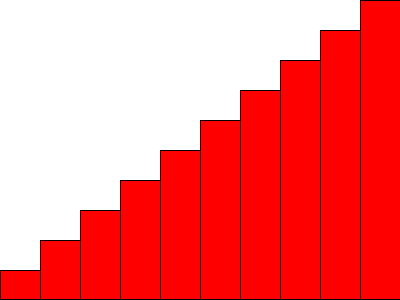
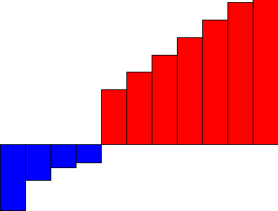
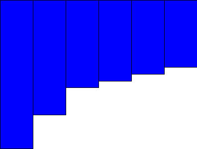

# Sort
**Points:** 1 ` | ` **Keywords:** control flow, subprograms, VHDLDraw

Your task is to implement the resursive version of either Merge Sort or Quicksort.
An excellent reference for these two algorithms is the material you were provided with in the Introduction to Programming 1 (Einführung in die Programmierung 1) course.

The file [sorting.vhd](src/sorting.vhd) already provides you with a skeleton for your implementation.

Your implementation shall

- work **in-place** on the `data` array passed to `mergesort` (i.e., content of the passed array shall be modified!),
- be able to sort input arrays of type `int_arr_t` of arbitrary length (within the limits of VHDL),
- be able to handle arbitrary array ranges,
- work for array elements of type `integer` (including negative numbers),
- work for recurring numbers as well (i.e., having two times the same number in `data` must not be a problem),
- order the array elements in ascending order
- be **recursive**

To visualize the correctness of your implementation implement the `draw_array` procedure, which uses [VHDLDraw](../../lib/vhdldraw/doc.md) to draw a bar chart of the sorted array.
The respective chart shall be exported to a file called `sortedX.ppm` where `X` is a counter which is incremented with each call to `draw_array`.
Use the `cnt` parameter for that.

Below you can find some examples, showing the array to be sorted (also given in [sorting.vhd](src/sorting.vhd)) as well as the respective bar chart.
Use colors to distinguish between positive (red in the examples) and negative (blue) array elements when drawing.

```vhdl
variable arr0 : int_arr_t(-10 downto -19) := (10, 9, 8, 7, 6, 5, 4, 3, 2, 1);
```



```vhdl
variable arr1 : int_arr_t(-5 to 5) := (-12, 45, 78, -23, 56, 89, 34, 67, 91, -15, -42);
```



```vhdl
variable arr2 : int_arr_t(5 downto 0) := (-10, -11, -12, -13, -17, -22);
```



**Remark**: Naturally the graphical output can hardly handle arbitrary long arrays.
However, make sure that the drawing works for arrays of a length of up to 199 (this allows you to still observe the bar colors with the pre-defined frame width of 400 pixels).