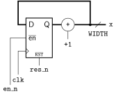
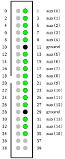

# Post-Layout Simulation

**Points:** 2 `|` **Keywords**: post-layout simulation, oscilloscope, synthesis

[[_TOC_]]

Your task is to perform a post-layout simulation for a simple counter design to observe realistic propagation delays within a simulation.
Furthermore, these delays are also measured in hardware using an oscilloscope.


## Background

You might have already noticed that the last step in the Quartus compilation process is called "EDA Netlist Writer".
In this step Quartus generates netlists and Standard Delay Format (SDF) files that are compatible with various Electronic Design Automation (EDA) tools.
The primary purpose of this step is to allow other tools to analyze, validate, and verify the design produced by Quartus.

So far in this course we only performed behavioral simulations, i.e., simulations that directly simulate the provided VHDL code without any regard for the actual gate-level design derived during synthesis, let alone the gate or interconnect delays that are associated with a real circuit.
However, in this task we will use the actual netlist produced by Quartus after the *"Place and Route"* implementation step to perform a so called post-layout simulation with realistic component and interconnect delays.

For this purpose, Quartus generates a set of file pairs, where one ends in the extension `.vho` and the other in `.sdo` (for example: `top.vho` and `top_vhd.sdo`).
You can find those files in the `simulation` subdirectory of the `quartus` project folder.
The `simulation` directory then in turn contains a subdirectory named after the tool these files taget (e.g., `questasim` or `modelsim`).

The `.vho` file is a standard VHDL file that contains the netlist of the compiled design.
It can be thousands of lines long (even for very simple designs) and basically contains instances for all the FPGA resources (LUTs, flip-flops, Block-RAM, I/O cells, multipliers) used by the design.
It is essentially a textual representation of what the *"Technology-Map Viewer"* or the *"Chip-Planner*" show you in graphical form.

The `.sdo` file contains the actual delay information for all the instances in the netlist.
Simulations can also be performed without the `.sdo` file.
However, then only a functional validation of a design is possible.

Note that both of these files use text-based formats, allowing you to simply open and inspect them in any text-editor.

Finally, recall that we stated that Quartus generates a *set* of such file pairs.
The reason for this is that each of these pairs represent different operation conditions (operation "corners") for the design.
For each of these corners, a dedicated (static) timing analysis is performed.
This process is, hence, fittingly named "multi-corner timing analysis" and is used to determine the performance of a circuit across a range of operating conditions, such as variations in voltage, temperature, and process parameters.
This ensures the design meets timing requirements under all possible real-world scenarios, accounting for worst-case and best-case conditions.
However, you don't need to worry about that, as the provided [Makefile](Makefile) already selects a suitable pair of files.


## Description

Please note that the flow of this task is slightly different from the other ones, as you will to perform a series of steps and document your work in a lab report (use the template [report.md](report/report.md)).


### Hardware Design

As a first step, implement the architecture for the `counter` entity, which has the following interface and shall result in the circuit shown below (the counter shall have a wrap-around behavior)


```vhdl
entity counter is
	generic (
		WIDTH : positive := 8
	);
	port (
		clk : in std_logic;
		res_n : in std_logic;
		en_n : in std_logic;
		x : out std_ulogic_vector(WIDTH-1 downto 0)
	);
end entity;
```




After you implemented the architecture, synthesize your design using Quartus.
The top-level design ([top_arch.vhd](top_arch.vhd)) already contains an instance of the counter entity, with `WIDTH` set to 32.
The `en_n` input of the counter is connected to `switches(0)`, while its `x` output is connected to the 8 seven-segment displays of the board using the `to_segs` function.
The top design also connects the lower 8 bit of `x` of the counter to the `aux` output.
Hence, after a succesful synthesis you can download the design to the board should see a 32-bit hex-counter that counts upwards as long as `switches(0)` is zero.

Please note that in contrast to all other tasks in this course, in this task we do not set `dbg_top` as our top-level entity in Quartus, but directly uses the `top` entity.
The reason for that is that we don't want to have the `dbg_core` in the design when performing the post-Layout simulation, as it slightly complicates the task.
Since we don't really need to interact with the design anyway, this should not be a problem.

After you made sure that your design runs as expected on the board, go to [report.md](report/report.md), create and include the two screenshots the report asks for, and answer the question.


The Quartus project we provide you with is already configured such that, after a full compilation, it creates a set of files in the `quartus/simulation/questa` directory.
Open the simulation netlist, `top.vho`, contained in this directory in a text-editor.
Next, locate the instance of the LUT that calculates the LSB of the counter and the flip-flop instance that stores the LSB and add them to [report.md](report/report.md).

**Hint:** LUT instances are called `cycloneive_lcell_comb`, while flip-flops are named `dffeas`.


### Post-Layout Simulation

With the design ready, we can now perform the post-layout simulation.
To do this the [Makefile](Makefile) has been extended by two new targets named `sim_pl` and `sim_pl_gui`.
You can **only** run these target **after** the Quartus project has been successfully **synthesiszed**!.

We already provide you with a suitable testbench template in [top_tb.vhd](tb/top_tb.vhd).
As the file name suggests, this testbench instantiates the `top` design and not just the `counter` entity.
It therefore simulates the whole `top` design.
This is required, since this testbench must perform the post-layout simulation on the nestlist of the top-design produced by Quartus.


Before you continue with this task, run the testbench (as is) once as a normal behavioral simulation (`sim_gui`) and once as a post-layout simulation (`sim_pl_gui`).
Create a screenshot containing the clock, reset, enable and the `aux` signal (non-collapsed, i.e., all 8 bits must be visible!) for the first 200 ns after reset is released for both simulations and include them in [report.md](report/report.md).

As you can notice in these two simulations, in a "real" circuit signals don't change immediately after a clock edge, but only after some propagation delay.
Moreover, when a multi-bit signal changes from one value to another, the individual bits do not all change simultaneously, but within a certain time frame.
This time frame, i.e., the time difference between the first and the last bit of a multi-bit signal changing, is referred to as *skew*.
You are now going to measure this skew in the post-layout simulation.

To do so, implement the `measure_max_skew` process in the testbench.
This process shall measure the skew on the output signal `aux` and for all transitions on the `aux` signal until it reaches 255.
Moreover, it shall record and **report** the maximal skew value it measured and the accompanying `aux` value.

To measure skew, capture the time of the first and last bit transitions on `aux` for each output value.
To do this employ the following approach:
* Wait for a rising edge on the `clk` signal
* Wait for the first signal to change on the `aux` signal and record the current simulation time.
* Wait for the `aux` signal to stabilize on the next expected output value and record the current simulation time.
* Take the difference between the two recorded time stamps.


**Hints:**
 * Questa indicates `report` events in the waveform viewer via little triangles above the waveform.
 * If the simulation runs into a `wait until condition;` statement and the `condition` is already true, it waits for the `condition` to become false and then waits for it to become true again!
 * The current simulation time can be accessed via the `now` function in `standard` package.

Create a simulation screenshot, showing the transitions that produce the maximal skew!
Use cursors to show the exact skew value in the waveform viewer.
Finally, include this screenshot, as well as the output of your testbench for the skew measurement, in [report.md](report/report.md).


### Oscilloscope Measurement

Finally, you will also measure the skew using the mixed-signal oscilloscope provided in the lab.
Download the design to the FPGA board and switch on the scope.
The figure below shows how the scope is connected to the FPGA board, where the output `aux(i)` is connected to the digital input channel `i`  of the scope.




Set a trigger to the value that yields the maximal skew identified in the simulation and run a single measurement.
Use the cursors on the scope to measure the skew and create a screenshot of it, as well as one of the trigger condition.
Finally, add these two screenshots to [report.md](report/report.md) and answer the final question.


## Deliverables

- **Implement**: [report.md](report/report.md)

- **Implement**: [counter.vhd](src/counter.vhd)

- **Implement**: [top_tb.vhd](tb/top_tb.vhd)

- **Create**: design_rtl.png

- **Create**: design_rsrc.png

- **Create**: sim.png

- **Create**: sim_pl.png

- **Create**: sim_pl_skew.png

- **Create**: scope_trigger.png

- **Create**: scope_skew.png
