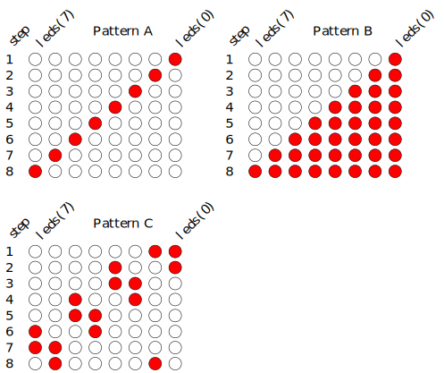

# Running Light

**Points:** 1 `|` **Keywords**: fsm modeling, fsm implementation

[[_TOC_]]

Your task is to implement a **state machine** in [running_light.vhd](src/running_light.vhd) that drives a series of LEDs in particular patterns.


## Description

The `running_light` module has the following interface:


```vhdl
entity running_light is
	generic (
		STEP_TIME  : time := 1 sec
	);
	port (
		clk      : in std_ulogic;
		res_n    : in std_ulogic;
		leds     : out std_ulogic_vector
	);
end entity;
```


where `clk` is the clock signal, `res_n` an asynchronous, low-active, reset signal and `leds` the output of the module.


- Consider the different LED patterns below (drawn for `LEDS_WIDTH=8`) and choose one for your implementation.



- Your state machine shall cycle through the chosen pattern and apply each step to `leds` for the time `STEP_TIME`. You can assume `clk` to have a frequency of 50 MHz.
- Once your FSM is done with applying the final step (8) for `STEP_TIME`, your FSM shall begin again the first step of the pattern."
- Make sure that during a reset the first step of the pattern is applied ot `leds`.


## Testbench

Implement a testbench for your `running_light` implementation in [running_light_tb.vhd](tb/running_light_tb.vhd) and create a wave configuration for Modelsim (wave.do) such that one can observe all steps of the pattern being applied to `leds` in the waveform viewer.
Make sure to set `STEP_SIZE` to a sufficiently small time value for your simulation (i.e., each step should just be shown for a few clock periods).


## Hardware

Once you have implemented and tested your `running_light` implementation, use the provided architecture in [top_arch.vhd](top_arch.vhd) to test your implementation on hardware (do not forget to reset your design!).


## Deliverables

- **Implement**: [running_light.vhd](src/running_light.vhd)

- **Implement**: [running_light_tb.vhd](tb/running_light_tb.vhd)

- **Create**: wave.do
