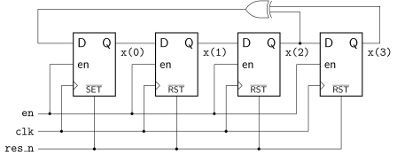

# Linear Feedback Sift Register
**Points:** - ` | ` **Keywords:** behavioral modeling, testbench

Implement a 4-bit LFSR, consisting of four D flip-flops and an XOR gate.
The schematic of this circuit is shown below:



The entity of the LFSR is shown below:

```vhdl
entity lfsr is
	port (
		clk   : in  std_ulogic;
		res_n : in  std_ulogic;
		en    : in  std_ulogic;
		x     : out std_ulogic_vector(3 downto 0)
	);
end entity;
```

Throughout this task you will need to edit the following files:

 * [`lfsr.vhd`](src/lfsr.vhd)
 * [`lfsr_tb.vhd`](tb/lfsr_tb.vhd).
 * [`top_arch.vhd`](top_arch.vhd).


# Testbench

Create a testbench for the LFSR and generate an appropriate clock signal.
Test if the first 8 values the LFSR produces (on `x`) after the reset are correct.
Don't forget to set the enable signal to high.
The correct values are (`x(3)` is the leftmost bit):

* `0001`
* `0010`
* `0100`
* `1001`
* `0011`
* `0110`
* `1101`
* `1010`

# Hardware Test

Add an instance of the `lfsr` entity to the top-level architecture in [`top_arch.vhd`](top_arch.vhd).

* Connect the clock signal to `clk`
* Connect `keys(0)` to `res_n`
* Connect `switches(0)` to `en`
* Connect `x` to `ledg(3 downto 0)`. Moreover, display `x` as a hexadecimal number on `hex7`, i.e., use the `to_segs` function of the [`util`](../../../lib/util/doc.md) package to convert `x` to a 7 bit number that can be assigned to `hex7`


Compile the design with Quartus and download it to the FPGA.

If the design works add a 22-bit wide counter to the top-level architecture.
The counter shall start at zero and count up with every clock cycle.
Let the counter overflow when it reached to maximum value.
The LFSR shall only be enabled if `switches(0)` and the counter value is zero.


[Return to main page](../../../readme.md)
