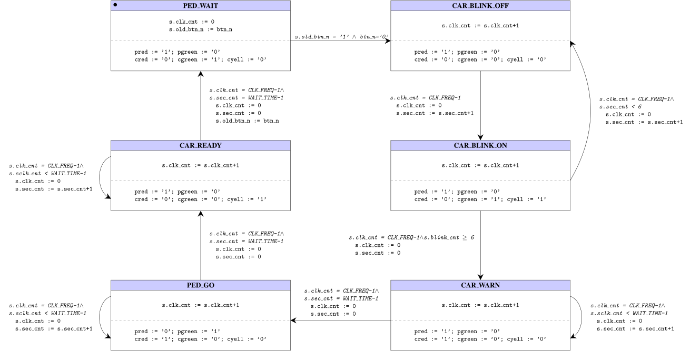

# Traffic Light

**Points:** - `|` **Keywords**: fsm modeling, fsm implementation

[[_TOC_]]

Your task is to model and implement a synchronous FSM for controlling the traffic lights at a street's pedestrian crossing of a street.

## Description

The pedestrian crossing comprises a traffic light for the cars with three lamps (red, yellow, green), one traffic light for the pedestrians with two lamps (red, green) and one button where pedestrians can signal that they wish to cross the street.
The image below illustrates this setting.

The traffic light shall satisfy the following sequence of steps:
- Initially the cars' traffic light shall be green and the pedestrian one red.
  All lamps can be controlled via single-bit active-high signals.
- When the active-low button is pushed, the car traffic light shall blink green its green lamp, such that it alternates between being on and off for one second a time (in total it shall be on four times during this blinking sequence).
  The pedestrian light remains red.
- Next, the car traffic light shall be yellow for a constant amount of seconds (referred to as *WAIT_TIME*), while the pedestrian light is still red.
- The cars' traffic light then becomes red, while the pedestrian light is green for *WAIT_TIME* seconds.
- Finally, the cars' traffic light shall show yellow, while the pedestrian one shows red, for *WAIT_TIME* before the car's traffic light becomes green again.
  The traffic light system is now again in the initial state.

Start by creating a model of the system, then come up with a suitable entity declaration and finally implement the FSM in VHDL.

 Below you can find the model which we used when implementing the FSM in [traffic_light.vhd](src/traffic_light.vhd):

## Testbench

Implement a testbench for your design in traffic_light__tb.vhd.
Your testbench shall simulate one full sequence of the traffic light operation, starting from when the pedestrian button is pushed and continuing until the system returns to its initial state.

## Hardware

In [top_arch.vhd](top_arch.vhd) you are provided with an instantiation of your design where the right-most button acts as asynchronous, active low reset.
Connect the pedestrian button to the left-most key (<i>keys(3)</i>) and the car traffic light lamps to the three right most red LEDs.
Connect the two pedestrian traffic light lamps to the two right-most green LEDs.

## Deliverables

- **Implement**: [traffic_light.vhd](src/traffic_light.vhd)

- **Implement**: [traffic_light_tb.vhd](tb/traffic_light_tb.vhd)
